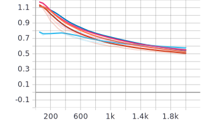
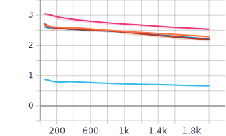
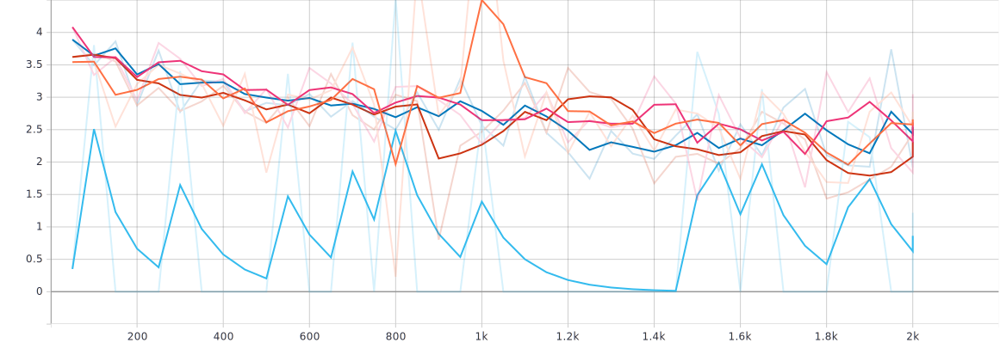

## Objective
Comparing the first 2000 training steps of keras_retinanet model on LADDV4 dataset when shifting pyramid levels from P3-P7 to P2-P6 or P2-P5.  
Configurations used (pay attention to strides settings in P2-Px configs):

### Base
[anchor_parameters]  
sizes   = 16 32 64 128 256  
strides = 8 16 32 64 128  
ratios  = 0.5 1 2 3  
scales  = 1 1.2 1.6  

[pyramid_levels]  
levels = 3 4 5 6 7

### P2-P6
[anchor_parameters]  
sizes   = 16 32 64 128 256  
strides = 4 8 16 32 64  
ratios  = 0.5 1 2 3  
scales  = 1 1.2 1.6  

[pyramid_levels]  
levels = 2 3 4 5 6

### P2-P5 with high 4 anchor sizes 
[anchor_parameters]  
sizes   = 32 64 128 256  
strides = 4 8 16 32  
ratios  = 0.5 1 2 3  
scales  = 1 1.2 1.6  

[pyramid_levels]  
levels = 2 3 4 5  

### P2-P5 with low 4 anchor sizes
[anchor_parameters]  
sizes   = 16 32 64 128  
strides = 4 8 16 32  
ratios  = 0.5 1 2 3  
scales  = 1 1.2 1.6  

[pyramid_levels]  
levels = 2 3 4 5   

### P2-P5 with anchor sizes starting from 8 px
[anchor_parameters]  
sizes   = 8 16 32 64  
strides = 4 8 16 32  
ratios  = 0.5 1 2 3  
scales  = 1 1.2 1.6  

[pyramid_levels]  
levels = 2 3 4 5  

## mAp results

| Training Type |   mAP     |  color                                                                     |
| ------------- | --------- |----------------------------------------------------------------------------|
| Base          |  0.3167   |             |
| P2-P6         |  0.519    |             |
| P2-P5 high    |  0.03703  |             |
| P2-P5 low     |  0.5502   |             |
| P2-P5 a8      |  0.4084   |             |

*Classification loss*

*Regression loss*

*Total loss*

The training advantage of using pyramid levels from P2 instead of P3 is obvious, but unfortunately there's a drawback there: longer inference time.  
When run on CPU Intel® Core™ i9-9880H 2.30GHz×16, 16 Gb RAM, inference time comparison gives the following results:

| Training Type |   Time    |
| ------------- | --------- |
| Base          |  0.6789   |
| P2-P6         |  1.8602   |
| P2-P5 low     |  1.7441   |
